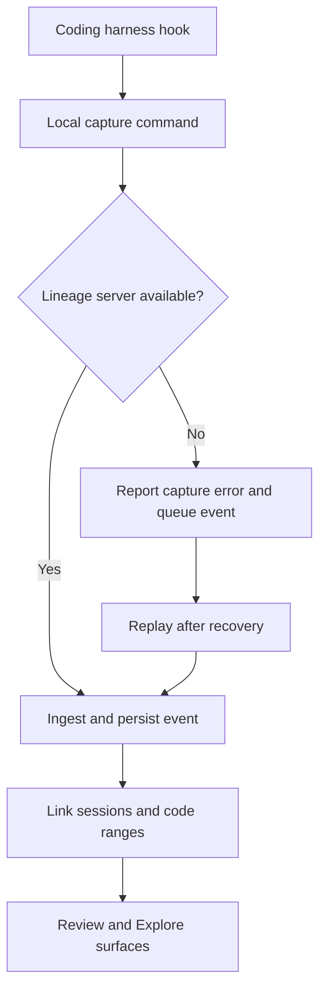
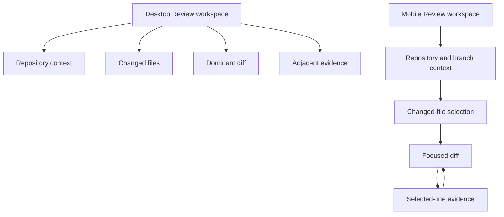

# Web-Only Lineage - Plan

## Goal Capsule

- **Objective:** Replace the macOS and Swift implementation with a self-hosted, responsive web application that reaches full product parity before the Swift product is decommissioned.
- **Product authority:** This plan owns the self-hosted web replacement, server-centric capture, compatibility with existing provenance data, removal of the throwaway mobile experiment, and final Swift decommissioning.
- **Open blockers:** None. Remaining technology and mechanism choices are deferred to planning.

---

## Product Contract

### Summary

Lineage becomes a self-hosted web application that runs on the same machine as the repositories it inspects.
The local server owns capture, linking, Git access, persistence, and presentation while preserving the existing repository-local provenance data.
The Review-first interface provides every current capability on desktop and mobile before Swift is removed.

### Problem Frame

Lineage is currently divided between a native SwiftUI product and a Swift capture command.
That implementation limits the product to macOS and makes the browser-based, centrally hosted direction harder to pursue.

An untracked Expo client and Node server tested remote access but do not represent the desired product or a migration base.
The replacement must preserve the mature provenance behavior in the tracked Swift code without preserving Swift itself.

### Key Decisions

- **Discard the mobile experiment** (session-settled: user-directed — chosen over reusing the Expo client and Node server: the experiment was a throwaway test). Governs R1 and R2.
- **Ship self-hosted first** (session-settled: user-directed — chosen over delivering self-hosted and centrally hosted modes together: the current run must replace the local product first). Governs R3 and R4.
- **Require full parity before decommissioning Swift** (session-settled: user-directed — chosen over a Review-and-Explore-only release: every current capability must survive the replacement). Governs R1, R18, and R20.
- **Use existing provenance data as the authority** (session-settled: user-directed — chosen over a new or migrated storage model: existing repositories must continue to work without recapture). Governs R7 and R8.
- **Make capture server-centric** (session-settled: user-directed — chosen over direct file capture and dual transport: this better supports the eventual centrally hosted service). Governs R9 through R12.
- **Lead with the high-density Review workspace** (session-settled: user-directed — chosen over reduced workbench and artifact-canvas layouts: Review and diffs should remain the dominant experience). Governs R13, R16, and R17.
- **Deliver every capability on mobile** (session-settled: user-directed — chosen over limiting repository and capture administration to desktop: responsive design must not remove functions). Governs R17 and R18.

<!-- ce-section: work-relationships -->
### How This Work Fits Together

This plan owns one coherent outcome: a complete self-hosted replacement followed by Swift decommissioning.
The broader breakdown below is contextual rather than a committed roadmap.

- **Enables:** A centrally hosted Lineage service can later reuse the server-centric capture boundary and web product.
  - **Depends on later work:** Central accounts, tenancy, remote repository connectivity, and hosted operations remain separate product work.
- **Can proceed independently of:** Central hosting, because the self-hosted product reads repositories and persists provenance on the same machine.

### Actors

- A1. **Engineer or reviewer:** Opens repositories, reviews changes, explores existing lines, inspects evidence, administers capture, and exports records.
- A2. **Self-hosted operator:** Runs Lineage on the same machine as the repositories and controls who may access its local capabilities.
- A3. **Coding harness:** Codex or GitHub Copilot CLI emits lifecycle events through installed hooks.
- A4. **Local capture command:** Receives hook input, submits it to the Lineage server, and protects the coding harness from capture failures.
- A5. **Lineage server:** Owns repository access, event ingestion, outage replay, session linking, explanations, exports, and the web application.

### Requirements

**Replacement and decommissioning**

- R1. The web product must reproduce every capability available in the tracked Swift application and capture command before the Swift implementation is removed.
- R2. The throwaway `mobile/` client, `server/` experiment, related ignore rules, and `mobile-expo-tailscale` branch must be discarded rather than used as the replacement foundation.
- R3. The first production milestone must be a self-hosted web application rather than a centrally hosted service.
- R4. The self-hosted server must run on the same machine as the repositories it opens.
- R5. The completed product must have no Swift source, Swift package, Swift build, Swift test, or Swift runtime dependency.

**Repository lifecycle and access**

- R6. A user must be able to select an existing local Git repository in the web application and have Lineage remember it in a machine-local registry for later visits.
- R7. Lineage must reject invalid or inaccessible repository paths without exposing filesystem content outside the selected repository.
- R8. The application must open existing repositories and use their current `.lineage/provenance` data without recapture or manual migration.
- R9. Access to repository contents, branch operations, capture administration, and exports must be protected by an explicit self-hosted access boundary.

**Capture and provenance**

- R10. Codex and GitHub Copilot CLI hooks must submit their supported lifecycle events to the local Lineage server through a non-Swift capture command.
- R11. A capture-server outage must never block, fail, or materially delay the coding harness.
- R12. When the server is unavailable, the capture command must report the failure, durably queue the event, and replay queued events automatically after service returns.
- R13. Capture health must expose server outages, queued-event backlog, replay progress, and restored operation without claiming complete coverage while events are pending.
- R14. The server must preserve provider attribution, native payload evidence, event ordering, session linking, line-range mapping, decision records, external constraints, and Git evidence available in the current product.

**Review, Explore, and evidence**

- R15. Review must remain the primary workflow and retain base-branch selection, changed-file grouping, review metrics, hunk diffs, provenance markers, provider-first explanations, and Git-only fallback.
- R16. Explore must retain repository browsing, file search, source display, line selection, line explanations, reference context, and incident-history archaeology.
- R17. Session evidence must retain provider details, prompts, tools, commands, permissions, decisions, constraints, tests, diffs, final messages, transcripts, linked ranges, provenance graph context, and follow-up explanations where current data supports them.
- R18. Repository removal and restoration, branch switching, refresh, demo repository creation, capture installation and diagnostics, explanation export, session evidence export, and Agent Trace export must remain available.

**Responsive interface**

- R19. The desktop workspace must use a high-density multi-pane composition with repositories and changed files visible, the selected diff dominant, and provenance evidence adjacent to the selected hunk or line.
- R20. Every capability governed by R6 through R18 must remain operable on phone and tablet layouts through focused sequential views rather than squeezed desktop panes.
- R21. Content and controls must remain visible by default, readable at each supported viewport, clear of clipped edges, and functional through real pointer and touch interaction.
- R22. The interface must use one cohesive, product-specific visual language without generic template ornament, motion that shifts controls, or effects that compromise contrast and legibility.

**Parity and cutover**

- R23. A parity inventory must map every tracked Swift capability and testable behavior to a verified web equivalent.
- R24. Existing provenance fixtures must produce equivalent user-visible explanations, review associations, evidence, and exports in the replacement.
- R25. Swift decommissioning may begin only after the web application, server, capture command, responsive workflows, compatibility checks, and replacement tests satisfy the parity inventory.
- R26. User and contributor documentation must describe only the supported web product and non-Swift capture workflow after decommissioning.

### Key Flows

- F1. Open and remember a repository
  - **Trigger:** A1 opens repository management.
  - **Actors:** A1, A5
  - **Steps:** A1 selects a local directory; A5 validates its Git root and access boundary; A5 stores it in the local registry; the repository becomes available on later visits.
  - **Outcome:** The repository opens without upload, clone, or repeated import.
  - **Covered by:** R4, R6 through R9.

- F2. Capture a healthy coding session
  - **Trigger:** A3 emits a supported lifecycle event.
  - **Actors:** A3, A4, A5
  - **Steps:** A4 accepts hook input and submits it to A5; A5 normalizes and persists the event; session linking updates the evidence available to Review and Explore.
  - **Outcome:** The event appears in the existing provenance model without affecting the coding session.
  - **Covered by:** R8, R10, R14.

- F3. Recover capture after an outage
  - **Trigger:** A4 cannot reach A5.
  - **Actors:** A3, A4, A5
  - **Steps:** A4 reports the capture failure, queues the event, and returns success to A3; capture health shows the interruption; queued events replay after A5 recovers.
  - **Outcome:** Coding continues uninterrupted and delayed evidence becomes durable without silent loss.
  - **Covered by:** R11 through R13.

- F4. Review a branch with provenance
  - **Trigger:** A1 opens a remembered repository in Review.
  - **Actors:** A1, A5
  - **Steps:** A1 selects a base branch and changed file; A5 renders the diff and provenance markers; selecting a hunk or line reveals provider evidence and Git fallback beside the diff.
  - **Outcome:** A1 can determine why the branch changed before merge.
  - **Covered by:** R15, R17, R19.

- F5. Use Lineage on a phone
  - **Trigger:** A1 opens the self-hosted application on a narrow viewport.
  - **Actors:** A1, A5
  - **Steps:** A1 navigates the same repository, Review, Explore, capture, and export capabilities through focused views; context remains available while moving between file, diff, and evidence.
  - **Outcome:** No product capability is hidden or disabled because of viewport size.
  - **Covered by:** R20, R21.

- F6. Decommission Swift
  - **Trigger:** The parity inventory and replacement verification pass.
  - **Actors:** A2
  - **Steps:** A2 removes the Swift product, tests, packaging, and build dependencies; A2 replaces stale macOS and Swift documentation; the web product and non-Swift capture path remain the only supported implementation.
  - **Outcome:** Lineage is web-only with no Swift dependency.
  - **Covered by:** R1, R5, R23 through R26.

### Acceptance Examples

- AE1. Remembered repository
  - **Covers R6.**
  - **Given:** A valid local Git repository has been opened once.
  - **When:** The Lineage server restarts and the user returns.
  - **Then:** The repository remains listed and can be reopened without importing it again.

- AE2. Invalid repository boundary
  - **Covers R7 and R9.**
  - **Given:** A user selects a non-repository path or requests a file outside an opened repository.
  - **When:** The server validates the request.
  - **Then:** Lineage rejects it without returning unrelated filesystem content.

- AE3. Existing provenance
  - **Covers R8, R14, and R23.**
  - **Given:** A repository already contains events and linked sessions created by the Swift product.
  - **When:** The web replacement opens the repository.
  - **Then:** Review, Explore, evidence, explanations, and exports use that data without migration or recapture.

- AE4. Healthy capture
  - **Covers R10 and R14.**
  - **Given:** The Lineage server is healthy and capture is installed.
  - **When:** Codex or Copilot CLI emits supported lifecycle events.
  - **Then:** The server persists attributed events and updates linked session evidence.

- AE5. Capture outage
  - **Covers R11 through R13.**
  - **Given:** The Lineage server is unavailable.
  - **When:** A coding harness emits an event.
  - **Then:** The hook reports the capture error, queues the event durably, and returns success without disrupting the coding harness.

- AE6. Capture replay
  - **Covers R12 through R14.**
  - **Given:** Capture events accumulated during an outage.
  - **When:** The server becomes reachable.
  - **Then:** The backlog replays without silent loss or duplicate durable evidence, and capture health returns to complete only after replay succeeds.

- AE7. Responsive parity
  - **Covers R20 through R22.**
  - **Given:** A user opens Lineage on a supported phone-sized viewport.
  - **When:** The user performs repository setup, capture administration, Review, Explore, or export tasks.
  - **Then:** Each task is usable through touch interaction with readable, unclipped content and no viewport-specific feature removal.

- AE8. Decommission gate
  - **Covers R1, R5, and R23 through R26.**
  - **Given:** One or more parity items or replacement checks are incomplete.
  - **When:** Swift removal is considered.
  - **Then:** Decommissioning remains blocked until every required equivalent and compatibility check passes.

### Success Criteria

- The parity inventory contains no unverified current capability when Swift removal starts.
- Existing repository provenance produces equivalent Review, Explore, evidence, explanation, and export outcomes.
- Codex and Copilot capture remain non-blocking during healthy operation, outages, and replay.
- Every feature is demonstrably usable on desktop and phone-sized viewports.
- The final supported product contains no Swift code, Swift build metadata, macOS packaging dependency, or discarded Expo experiment.
- Product documentation contains no stale Swift or macOS setup path after cutover.

### Scope Boundaries

**Deferred for later**

- Centrally hosted Lineage accounts and tenancy.
- Remote repository connectors and repositories that are not present on the Lineage server host.
- Network capture from machines other than the self-hosted server.
- Production deployment and distribution choices for the centrally hosted service.

**Outside this product milestone**

- Tailscale as an end-user requirement; it is only a development access method.
- Reuse or preservation of the Expo client, experimental Node server, or mobile Git branch.
- A partial replacement that removes Swift before full parity.
- A desktop-only or reduced-capability mobile experience.

### Dependencies and Assumptions

- Git and the supported coding harnesses are installed on the self-hosted machine.
- The self-hosted operator grants Lineage filesystem and branch-operation access to selected repositories.
- Existing provenance files remain the durable compatibility contract for this milestone.
- The local capture command can persist an outage queue independently of server availability.
- The future hosted service may change deployment and repository connectivity without changing the meaning of captured provenance.

### Outstanding Questions

**Deferred to Planning**

- Choose the web application, server runtime, and non-Swift capture-command technologies.
- Define the authenticated self-hosted access boundary and its safe default when the server binds beyond loopback.
- Define the repository chooser and machine-local registry mechanisms within browser and server security constraints.
- Define queue storage, replay ordering, retry, deduplication, and backlog limits while preserving R11 through R14.
- Build the parity inventory from the tracked Swift product and decide how equivalent behavior is tested before cutover.

### Sources and Research

- `README.md:7-25` defines the current local-first product, Review, and Explore.
- `README.md:36-70` defines capture storage and diagnostics.
- `README.md:105-191` defines provider installation and Review behavior.
- `Package.swift:1-29` defines the current Swift targets and tests.
- `Sources/Lineage/LineageApp.swift:17-72` exposes the native product commands that require parity.
- `Sources/Lineage/LineageApp.swift:77-171` defines remembered repositories and repository opening behavior.
- `Sources/Lineage/LineageApp.swift:243-589` contains demo, branch, explanation, capture, follow-up, and export behavior that requires parity.
- `Sources/Lineage/Views.swift:620-776` defines Review/Explore selection, branch controls, and capture status.
- `Sources/Lineage/Views.swift:2030-2136` defines session evidence and Markdown/JSON exports.
- `Sources/LineageCore/ProvenanceStore.swift:21-108` defines the existing durable provenance contract.
- `Sources/LineageCore/HookConfig.swift:3-107` defines the supported Codex and Copilot hook lifecycles.
- `Scripts/build-macos-app.sh:14-24` defines the Swift-based macOS packaging path that must be removed after parity.
