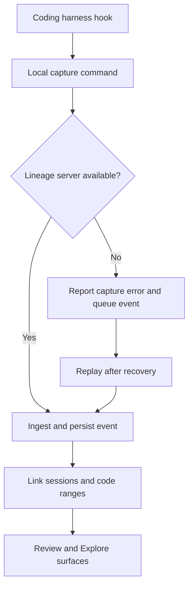
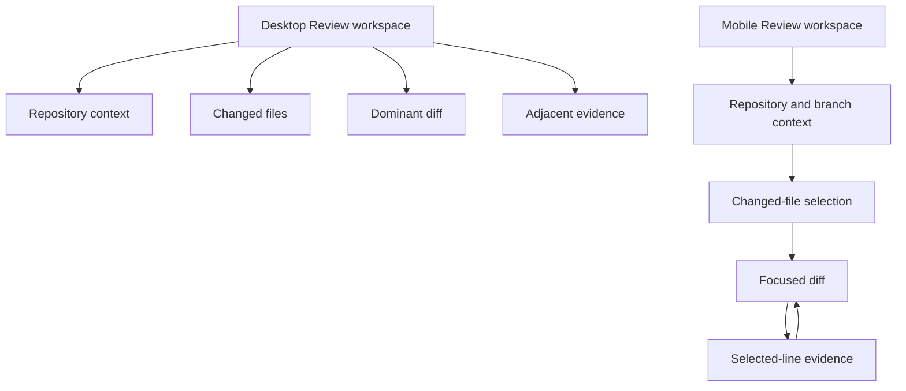
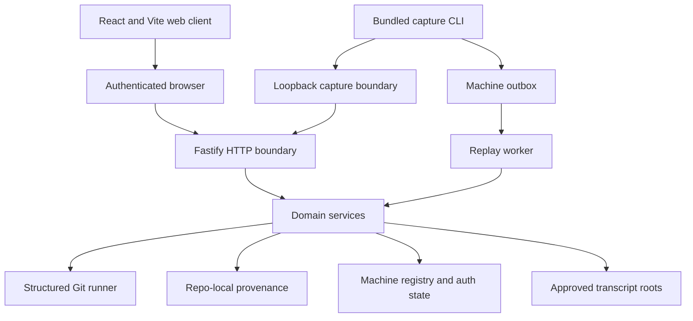
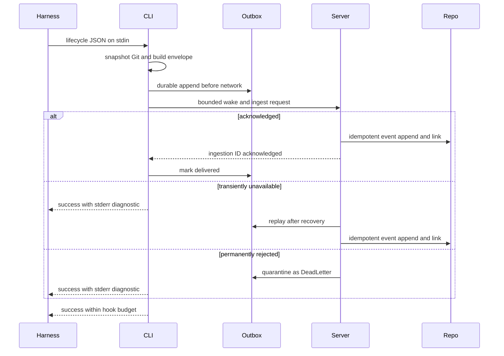
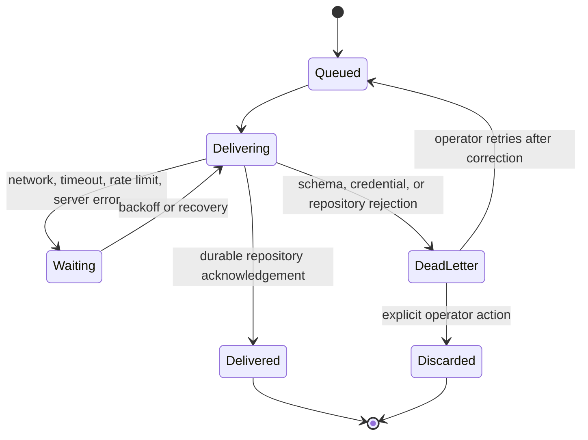
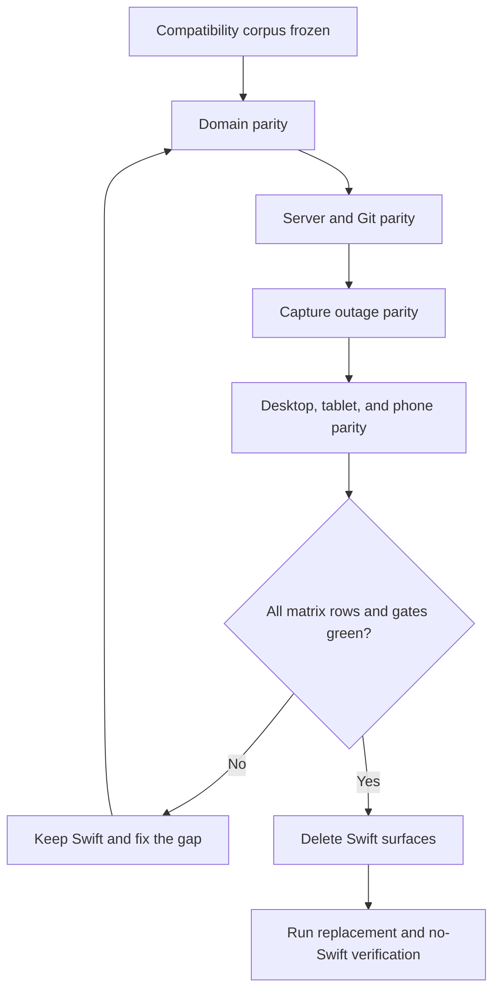

# Web-Only Lineage - Plan

## Goal Capsule

- **Objective:** Replace the macOS and Swift implementation with a self-hosted, responsive web application that reaches full product parity before the Swift product is decommissioned.
- **Product authority:** This plan owns the self-hosted web replacement, server-centric capture, compatibility with existing provenance data, removal of the throwaway mobile experiment, and final Swift decommissioning.
- **Execution profile:** Deep, security-sensitive strangler replacement across storage, Git, capture, HTTP, browser UI, and build/runtime surfaces.
- **Stop conditions:** Stop before Swift deletion if any compatibility fixture, parity row, capture recovery case, security gate, desktop flow, or mobile flow is unverified.
- **Tail ownership:** The implementation run owns build, browser verification, Tailscale development serving, Swift removal, documentation, and the pull-request tail through green CI.
- **Open blockers:** None. Technology, access, replay, compatibility, and cutover mechanisms are settled below.

---

## Product Contract

### Summary

Lineage becomes a self-hosted web application that runs on the same machine as the repositories it inspects.
The local server owns capture, linking, Git access, persistence, and presentation while preserving the existing repository-local provenance data.
The Review-first interface provides every current capability on desktop and mobile before Swift is removed.

Product Contract preservation: restructured with no scope reduction; R7 is clarified to forbid arbitrary host-file access while retaining the already-required, allowlisted Codex transcript evidence governed by R17.

### Problem Frame

Lineage is currently divided between a native SwiftUI product and a Swift capture command.
That implementation limits the product to macOS and makes the browser-based, centrally hosted direction harder to pursue.

An untracked Expo client and Node server tested remote access but do not represent the desired product or a migration base.
The replacement must preserve the mature provenance behavior in the tracked Swift code without preserving Swift itself.

### Key Decisions

- **Discard the mobile experiment** (session-settled: user-directed — chosen over reusing the Expo client and Node server: the experiment was a throwaway test). Governs R1 and R2.
- **Ship self-hosted first** (session-settled: user-directed — chosen over delivering self-hosted and centrally hosted modes together: the current run must replace the local product first). Governs R3 and R4.
- **Require full parity before decommissioning Swift** (session-settled: user-directed — chosen over a Review-and-Explore-only release: every current capability must survive the replacement). Governs R1, R5, R18, R20, R23, and R25.
- **Use existing provenance data as the authority** (session-settled: user-directed — chosen over a new or migrated storage model: existing repositories must continue to work without recapture). Governs R8, R14, and R24.
- **Make capture server-centric** (session-settled: user-directed — chosen over direct file capture and dual transport: this better supports the eventual centrally hosted service). Governs R10 through R14.
- **Lead with the high-density Review workspace** (session-settled: user-directed — chosen over reduced workbench and artifact-canvas layouts: Review and diffs should remain the dominant experience). Governs R15 through R17 and R19.
- **Deliver every capability on mobile** (session-settled: user-directed — chosen over limiting repository and capture administration to desktop: responsive design must not remove functions). Governs R18 and R20 through R22.

<!-- ce-section: work-relationships -->
### How This Work Fits Together

This plan owns one coherent outcome: a complete self-hosted replacement followed by Swift decommissioning.
The broader breakdown below is contextual rather than a committed roadmap.

- **Enables:** A centrally hosted Lineage service can later reuse the server-centric capture boundary and web product.
  - **Depends on later work:** Central accounts, tenancy, remote repository connectivity, and hosted operations remain separate product work.
- **Can proceed independently of:** Central hosting, because the self-hosted product reads repositories and persists provenance on the same machine.

### Actors

- A1. **Engineer or reviewer:** Opens repositories, reviews changes, explores existing lines, inspects evidence, administers capture, and exports records.
- A2. **Self-hosted operator:** Runs Lineage on the same machine as the repositories and controls who may access its local capabilities.
- A3. **Coding harness:** Codex or GitHub Copilot CLI emits lifecycle events through installed hooks.
- A4. **Local capture command:** Receives hook input, submits it to the Lineage server, and protects the coding harness from capture failures.
- A5. **Lineage server:** Owns repository access, event ingestion, outage replay, session linking, explanations, exports, and the web application.

### Requirements

**Replacement and decommissioning**

- R1. The web product must reproduce every capability available in the tracked Swift application and capture command before the Swift implementation is removed.
- R2. The throwaway `mobile/` client, `server/` experiment, related ignore rules, and `mobile-expo-tailscale` branch must be discarded rather than used as the replacement foundation.
- R3. The first production milestone must be a self-hosted web application rather than a centrally hosted service.
- R4. The self-hosted server must run on the same machine as the repositories it opens.
- R5. The completed product must have no Swift source, Swift package, Swift build, Swift test, or Swift runtime dependency.

**Repository lifecycle and access**

- R6. A user must be able to select an existing local Git repository in the web application and have Lineage remember it in a machine-local registry for later visits.
- R7. Lineage must reject invalid or inaccessible repository paths and arbitrary request-driven host-file access. Outside a selected repository, Lineage may access only its own permission-restricted machine state and provider transcript evidence under an operator-approved, canonicalized transcript root matched to that repository.
- R8. The application must open existing repositories and use their current `.lineage/provenance` data without recapture or manual migration.
- R9. Access to repository contents, branch operations, capture administration, and exports must be protected by an explicit self-hosted access boundary.

**Capture and provenance**

- R10. Codex and GitHub Copilot CLI hooks must submit their supported lifecycle events to the local Lineage server through a non-Swift capture command.
- R11. A capture-server outage must never block, fail, or materially delay the coding harness.
- R12. When the server is unavailable, the capture command must report the failure, durably queue the event, and replay queued events automatically after service returns.
- R13. Capture health must expose server outages, queued-event backlog, replay progress, and restored operation without claiming complete coverage while events are pending.
- R14. The server must preserve provider attribution, native payload evidence, event ordering, session linking, line-range mapping, decision records, external constraints, and Git evidence available in the current product.



**Review, Explore, and evidence**

- R15. Review must remain the primary workflow and retain base-branch selection, changed-file grouping, review metrics, hunk diffs, provenance markers, provider-first explanations, and Git-only fallback.
- R16. Explore must retain repository browsing, file search, source display, line selection, line explanations, reference context, and incident-history archaeology.
- R17. Session evidence must retain provider details, prompts, tools, commands, permissions, decisions, constraints, tests, diffs, final messages, transcripts, linked ranges, provenance graph context, and follow-up explanations where current data supports them.
- R18. Repository removal and restoration, branch switching, refresh, demo repository creation, capture installation and diagnostics, explanation export, session evidence export, and Agent Trace export must remain available.

**Responsive interface**

- R19. The desktop workspace must use a high-density multi-pane composition with repositories and changed files visible, the selected diff dominant, and provenance evidence adjacent to the selected hunk or line.
- R20. Every capability governed by R6 through R18 must remain operable on phone and tablet layouts through focused sequential views rather than squeezed desktop panes.
- R21. Content and controls must remain visible by default, readable at each supported viewport, clear of clipped edges, and functional through real pointer and touch interaction.
- R22. The interface must use one cohesive, product-specific visual language without generic template ornament, motion that shifts controls, or effects that compromise contrast and legibility.



**Parity and cutover**

- R23. A parity inventory must map every tracked Swift capability and testable behavior to a verified web equivalent.
- R24. Existing provenance fixtures must produce equivalent user-visible explanations, review associations, evidence, and exports in the replacement.
- R25. Swift decommissioning may begin only after the web application, server, capture command, responsive workflows, compatibility checks, and replacement tests satisfy the parity inventory.
- R26. User and contributor documentation must describe only the supported web product and non-Swift capture workflow after decommissioning.

### Key Flows

- F1. Open and remember a repository
  - **Trigger:** A1 opens repository management.
  - **Actors:** A1, A5
  - **Steps:** A1 selects a local directory; A5 validates its Git root and access boundary; A5 stores it in the local registry; the repository becomes available on later visits.
  - **Outcome:** The repository opens without upload, clone, or repeated import.
  - **Covered by:** R4, R6 through R9.

- F2. Capture a healthy coding session
  - **Trigger:** A3 emits a supported lifecycle event.
  - **Actors:** A3, A4, A5
  - **Steps:** A4 accepts hook input and submits it to A5; A5 normalizes and persists the event; session linking updates the evidence available to Review and Explore.
  - **Outcome:** The event appears in the existing provenance model without affecting the coding session.
  - **Covered by:** R8, R10, R14.

- F3. Recover capture after an outage
  - **Trigger:** A4 cannot reach A5.
  - **Actors:** A3, A4, A5
  - **Steps:** A4 reports the capture failure, queues the event, and returns success to A3; capture health shows the interruption; queued events replay after A5 recovers.
  - **Outcome:** Coding continues uninterrupted and delayed evidence becomes durable without silent loss.
  - **Covered by:** R11 through R13.

- F4. Review a branch with provenance
  - **Trigger:** A1 opens a remembered repository in Review.
  - **Actors:** A1, A5
  - **Steps:** A1 selects a base branch and changed file; A5 renders the diff and provenance markers; selecting a hunk or line reveals provider evidence and Git fallback beside the diff.
  - **Outcome:** A1 can determine why the branch changed before merge.
  - **Covered by:** R15, R17, R19.

- F5. Use Lineage on a phone
  - **Trigger:** A1 opens the self-hosted application on a narrow viewport.
  - **Actors:** A1, A5
  - **Steps:** A1 navigates the same repository, Review, Explore, capture, and export capabilities through focused views; context remains available while moving between file, diff, and evidence.
  - **Outcome:** No product capability is hidden or disabled because of viewport size.
  - **Covered by:** R20, R21.

- F6. Decommission Swift
  - **Trigger:** The parity inventory and replacement verification pass.
  - **Actors:** A2
  - **Steps:** A2 removes the Swift product, tests, packaging, and build dependencies; A2 replaces stale macOS and Swift documentation; the web product and non-Swift capture path remain the only supported implementation.
  - **Outcome:** Lineage is web-only with no Swift dependency.
  - **Covered by:** R1, R5, R23 through R26.

### Acceptance Examples

- AE1. Remembered repository
  - **Covers R6.**
  - **Given:** A valid local Git repository has been opened once.
  - **When:** The Lineage server restarts and the user returns.
  - **Then:** The repository remains listed and can be reopened without importing it again.

- AE2. Invalid repository boundary
  - **Covers R7 and R9.**
  - **Given:** A user selects a non-repository path or requests a file outside an opened repository.
  - **When:** The server validates the request.
  - **Then:** Lineage rejects it without returning unrelated filesystem content.

- AE3. Existing provenance
  - **Covers R8, R14, and R23.**
  - **Given:** A repository already contains events and linked sessions created by the Swift product.
  - **When:** The web replacement opens the repository.
  - **Then:** Review, Explore, evidence, explanations, and exports use that data without migration or recapture.

- AE4. Healthy capture
  - **Covers R10 and R14.**
  - **Given:** The Lineage server is healthy and capture is installed.
  - **When:** Codex or Copilot CLI emits supported lifecycle events.
  - **Then:** The server persists attributed events and updates linked session evidence.

- AE5. Capture outage
  - **Covers R11 through R13.**
  - **Given:** The Lineage server is unavailable.
  - **When:** A coding harness emits an event.
  - **Then:** The hook reports the capture error, queues the event durably, and returns success without disrupting the coding harness.

- AE6. Capture replay
  - **Covers R12 through R14.**
  - **Given:** Capture events accumulated during an outage.
  - **When:** The server becomes reachable.
  - **Then:** The backlog replays without silent loss or duplicate durable evidence, and capture health returns to complete only after replay succeeds.

- AE7. Responsive parity
  - **Covers R20 through R22.**
  - **Given:** A user opens Lineage on a supported phone- or tablet-sized viewport.
  - **When:** The user performs repository setup, capture administration, Review, Explore, or export tasks.
  - **Then:** Each task is usable through touch interaction with readable, unclipped content and no viewport-specific feature removal.

- AE8. Decommission gate
  - **Covers R1, R5, and R23 through R26.**
  - **Given:** One or more parity items or replacement checks are incomplete.
  - **When:** Swift removal is considered.
  - **Then:** Decommissioning remains blocked until every required equivalent and compatibility check passes.

### Success Criteria

- The parity inventory contains no unverified current capability when Swift removal starts.
- Existing repository provenance produces equivalent Review, Explore, evidence, explanation, and export outcomes.
- Codex and Copilot capture remain non-blocking during healthy operation, outages, and replay.
- Every feature is demonstrably usable on desktop, tablet, and phone-sized viewports.
- The final supported product contains no Swift code, Swift build metadata, macOS packaging dependency, or discarded Expo experiment.
- Product documentation contains no stale Swift or macOS setup path after cutover.

### Scope Boundaries

**Deferred for later**

- Centrally hosted Lineage accounts and tenancy.
- Remote repository connectors and repositories that are not present on the Lineage server host.
- Network capture from machines other than the self-hosted server.
- Production deployment and distribution choices for the centrally hosted service.

**Outside this product milestone**

- Tailscale as an end-user requirement; it is only a development access method.
- Reuse or preservation of the Expo client, experimental Node server, or mobile Git branch.
- A partial replacement that removes Swift before full parity.
- A desktop-only or reduced-capability mobile experience.

### Dependencies and Assumptions

- Git and the supported coding harnesses are installed on the self-hosted machine.
- The self-hosted operator grants Lineage filesystem and branch-operation access to selected repositories.
- Existing provenance files remain the durable compatibility contract for this milestone.
- The local capture command can persist an outage queue independently of server availability.
- The future hosted service may change deployment and repository connectivity without changing the meaning of captured provenance.

### Sources and Research

- `README.md:7-25` defines the current local-first product, Review, and Explore.
- `README.md:36-70` defines capture storage and diagnostics.
- `README.md:105-191` defines provider installation and Review behavior.
- `Package.swift:1-29` defines the current Swift targets and tests.
- `Sources/Lineage/LineageApp.swift:17-72` exposes the native product commands that require parity.
- `Sources/Lineage/LineageApp.swift:77-171` defines remembered repositories and repository opening behavior.
- `Sources/Lineage/LineageApp.swift:243-589` contains demo, branch, explanation, capture, follow-up, and export behavior that requires parity.
- `Sources/Lineage/Views.swift:620-776` defines Review/Explore selection, branch controls, and capture status.
- `Sources/Lineage/Views.swift:2030-2136` defines session evidence and Markdown/JSON exports.
- `Sources/LineageCore/ProvenanceStore.swift:21-108` defines the existing durable provenance contract.
- `Sources/LineageCore/HookConfig.swift:3-107` defines the supported Codex and Copilot hook lifecycles.
- `Scripts/build-macos-app.sh:14-24` defines the Swift-based macOS packaging path that must be removed after parity.
- `Sources/LineageCore/ProviderAdapters.swift:34-125` defines provider lifecycle differences and hook-time Git evidence.
- `Sources/LineageCore/ProvenanceLinker.swift:6-177` defines linking, decision, constraint, and line-range behavior.
- `Sources/LineageCore/SessionEvidence.swift:68-282` defines transcript loading, evidence exports, and secret redaction.
- `Sources/LineageCore/ProvenanceGraph.swift:175-307` and `Sources/LineageCore/AgentTraceExporter.swift:75-187` define stable graph and trace identifiers.
- [Vite Getting Started](https://vite.dev/guide/) establishes the supported Node baseline and React build path.
- [Fastify v5 Migration Guide](https://fastify.dev/docs/latest/Guides/Migration-Guide-V5/) establishes the Node 20+ and full JSON-schema route contract.
- [Fastify Validation and Serialization](https://fastify.dev/docs/latest/Reference/Validation-and-Serialization/) establishes request validation and response serialization as disclosure controls.
- [Playwright Emulation](https://playwright.dev/docs/emulation) establishes reproducible desktop, tablet, mobile, and touch browser projects.

---

## Planning Contract

### Key Technical Decisions

- KTD1. **One TypeScript product on Node 22.** Use a single npm workspace with strict TypeScript, React and Vite for the browser, Fastify for the HTTP server, and a bundled Node capture entry point. This keeps domain types shared, matches the available Node 22.23 runtime, avoids preserving either Swift or the discarded Expo experiment, and leaves an ordinary HTTP boundary for later central hosting.
- KTD2. **Server-owned domain and persistence.** The browser is a client of same-origin, schema-validated `/api/v1` routes and never reads Git or the filesystem directly. Runtime schemas are shared with the typed client; one bounded error contract and explicit source, diff, transcript, export, request-body, and execution limits apply across routes. Domain/storage services remain independent of HTTP and React so capture, browser, tests, and future hosting call the same linker, explanation, evidence, and export behavior.
- KTD3. **Exact legacy compatibility, tolerant readers, safer writers.** Continue reading `.lineage/provenance/events.jsonl` as snake-case ISO-8601 JSONL while skipping malformed lines, and continue reading every session JSON with historical missing fields and unknown provider payloads preserved. `CaptureEnvelope.ingestionId` becomes the durable `LineageEvent.id`; under the repository write lock the server checks the event ID index, appends and flushes the event, then acknowledges. Any receipt index is rebuildable from `events.jsonl`, never a second authority. New session, registry, and export writes are atomic; new session filenames are sanitized without renaming legacy files. Stable graph hashes, Agent Trace hashes, sort order, line expansion limits, redaction, and output naming remain compatibility contracts.
- KTD4. **Opaque repository identity and two trust surfaces.** The registry stores versioned records containing an opaque ID and canonical realpath under an operator-configured allowed root. Browser APIs accept repository IDs and server-enumerated refs only. Cryptographically random operator and capture credentials are displayed once, accepted only in request bodies or the isolated capture channel, and redacted from logs and diagnostics. The server stores constant-time comparable verifier digests; plaintext client secrets live only in mode-0600 files under a mode-0700 state directory. Operator login establishes a short-lived, server-side, revocable `HttpOnly`, `SameSite=Strict` session. Rotation invalidates old credentials and sessions; CSRF, Host/Origin allowlists, login throttling, restrictive CSP, and `no-store` sensitive responses protect the browser boundary.
- KTD5. **Loopback is the safe default.** The browser server listens on `127.0.0.1` unless an operator explicitly configures another bind and authentication/TLS termination. Capture uses a separate same-OS-user loopback socket or port that Tailscale and other reverse proxies never expose. Tailscale Serve proxies HTTPS only to the browser listener for team development; no application behavior, identity, or production requirement depends on Tailscale.
- KTD6. **CaptureEnvelope v1 freezes bounded hook-time truth.** The capture helper first durably records validated raw lifecycle input with an ingestion UUID reused as the event ID, provider/session/turn metadata, canonical cwd/repository identity, original capture time, and an allowlist of relevant environment values. Only lifecycle boundaries that consume Git evidence then collect HEAD/status/diff/changed files under hard subprocess, byte, and total hook budgets before the record is finalized for delivery. Timed-out or truncated snapshots carry hashes, truncation metadata, and an explicit incomplete-evidence state. Ordering prefers provider sequence metadata, otherwise uses capture time plus ingestion ID as a deterministic tie-breaker; session reduction is order-insensitive except for documented lifecycle precedence. Session-stop deltas derive only from persisted SessionStart and Stop snapshots, never replay-time Git.
- KTD7. **Durable-before-network, bounded fail-open capture.** Hook mode persists each record using temporary-file write, file flush, atomic rename, and directory flush where supported before making a bounded local request, then always exits success within one second even during server, auth, Git, or disk failure while emitting a clear stderr error. Pre-enqueue limits cover stdin, raw payload, Git diff, and total record bytes; per-repository and global byte/item quotas cover pending, claimed, and dead-letter records. Quota or storage exhaustion stops additional durable growth, keeps hook mode fail-open, and enters persistent degraded health without claiming evidence was saved. Cross-process claims have recoverable leases; server startup, an interval worker, and hook wake-ups drain deterministic provider/session order. At-least-once delivery is idempotent by KTD3 across CLI/server crashes and lost acknowledgements.
- KTD8. **Visible replay and permanent failure states.** Retry connection failures, timeouts, rate limits, and server errors with capped exponential backoff and jitter. Quarantine corrupt or permanently rejected schema/auth/repository items as durable dead letters so one poison record cannot block unrelated repositories. Capture health is `off`, `installed`, `healthy`, `interrupted`, `pending`, `replaying`, `degraded`, or `restored`; only zero pending/dead-letter items, no incomplete or quota-failed evidence, and a recent acknowledgement may be healthy.
- KTD9. **Preserve only the current harness contract.** Port the data-driven adapter/descriptor seam and the exact Codex and GitHub Copilot CLI hooks. Codex finalizes on `Stop`; Copilot maps `Stop` to `agent_stop` and finalizes only on `SessionEnd`. Preserve the stdin hook path plus `--doctor`, `--link`, `--verify-line`, and `--recover-codex`; hook mode fails open, while explicit diagnostic/admin commands fail closed.
- KTD10. **Review-first responsive state, not a compressed desktop.** React routes encode repository, branch, base, file, line/hunk, and session selection. Desktop at 1280px and above presents repository context, status-grouped files, dominant diff, and adjacent evidence in coordinated panes. Tablet from 768px through 1279px and phone below 768px use sequential context, file, diff, and evidence views with browser Back, reload, direct links, scroll restoration, touch-safe controls, and every repository, capture, demo, branch, follow-up, and export action retained. Boundary tests cover 767, 768, 1279, and 1280px plus relevant orientations.
- KTD11. **Strangler cutover with a hard oracle gate.** Freeze a capability matrix, immutable Swift baseline commit, fixture manifest, and checksummed normalized oracle artifacts while Swift still exists. Port pure behavior first, then host services, capture, and UI. Swift deletion is the final isolated unit and may start only when U6 proves the oracle matches the current fixture manifest and semantic golden comparisons, security/integration suites, and desktop/tablet/phone browser flows are recorded green.

### Assumptions

- Node 22.15 or newer and Git are installed on the self-hosted machine; the current VPS satisfies this baseline.
- The outbox lives on a local writable filesystem under the same OS account as the server and hooks. Startup diagnostics measure its flush/rename latency; the one-second hook guarantee applies only while that probe passes, and a failed probe enters explicitly non-durable degraded capture.
- The first operator can read a generated bootstrap token from the server host and can configure allowed repository and transcript roots.
- Same-origin HTTPS for team development is provided by Tailscale Serve or an equivalent reverse proxy; direct loopback use remains supported without Tailscale.
- Browser directory selection means browsing allowed directories on the Lineage host, not uploading or selecting a directory from the browser device.
- Repository removal forgets the registry entry only. It never deletes Git data, provenance, source files, or hook configuration.
- Path search retains the current tracked-file substring semantics; repository content search is deferred.
- Explanation and session Markdown/JSON are browser downloads. Agent Trace is a download and updates `.agent-trace/traces.jsonl` only after a separate explicit write action.
- Swift is unavailable on the current VPS. Compatibility fixtures therefore remain committed, reviewable artifacts and the Swift oracle runs on a Swift-capable macOS job before the final deletion gate.

### High-Level Technical Design

The following sketches communicate boundaries and lifecycle direction, not implementation syntax.









### Output Structure

```text
.
├── package.json
├── package-lock.json
├── tsconfig.json
├── vite.config.ts
├── playwright.config.ts
├── src
│   ├── domain
│   │   ├── models
│   │   ├── provenance
│   │   ├── providers
│   │   ├── explanation
│   │   └── exports
│   ├── server
│   │   ├── access
│   │   ├── repositories
│   │   ├── git
│   │   ├── capture
│   │   └── routes
│   ├── capture
│   └── web
│       ├── app
│       ├── review
│       ├── explore
│       ├── evidence
│       └── administration
├── tests
│   ├── fixtures
│   │   └── compatibility
│   ├── unit
│   ├── integration
│   └── e2e
├── docs
│   ├── parity
│   └── plans
└── scripts
```

### Responsive Route and State Map

| Destination | Route responsibility | Desktop | Tablet and phone |
|---|---|---|---|
| Login | Bootstrap token, invalid/throttled token, expired/revoked session, logout, and return-to-intended-route recovery | Dedicated auth surface before the workspace | Same surface with operator recovery instructions that point to the server host and never place the token in a URL |
| Repository library | Host-directory browse/manual entry, remembered/stale repos, remove/restore, demo reset, and active repository | Treated workspace entry plus active-repository switcher | Full-screen library reached from the persistent route bar |
| Review | Repository/branch/base context, status groups, file selection, diff, line/hunk evidence | Coordinated repository/files/diff/evidence panes | Sequential context, files, diff, and evidence routes with Back and scroll restoration |
| Explore | Tracked-path search, tree, source, line explanation, references, and follow-ups | Explorer and adjacent explanation | Sequential file, source, explanation, and session routes |
| Capture | Install/reinstall, doctor, queue/replay/dead letters, recovery, and provider status | Dedicated capture destination | Same destination in the persistent route bar, with every recovery action retained |
| Session | Timeline, graph, transcript, decisions, constraints, tests, ranges, and exports | Evidence pane or direct detail route | Direct detail route that returns to the originating Review or Explore selection |

Desktop uses a persistent treated workspace navigation for Repository, Review, Explore, and Capture.
Tablet and phone use one persistent bottom route bar for those same destinations and a repository-context control in the page header.
Exports remain actions within the evidence they export rather than becoming a separate destination.

| Capture state | Required presentation | Available actions |
|---|---|---|
| `off` | Harness not installed and no recent acknowledgement | Install selected provider; run doctor |
| `installed` | Installed but no accepted event yet | Run doctor; reinstall; view expected restart guidance |
| `healthy` | Recent acknowledgement, zero pending/dead letters/incomplete evidence | View details; run doctor |
| `interrupted` | Last transport or storage attempt failed | View last error and timestamp; retry; run doctor |
| `pending` | Backlog count and oldest age | Trigger retry; inspect bounded item metadata |
| `replaying` | Completed/remaining counts without hiding current evidence | Continue using Lineage; inspect progress |
| `degraded` | Dead-letter, quota, storage, auth, or incomplete-evidence counts and consequence | Inspect reason; retry corrected item; confirm explicit discard |
| `restored` | Recovery time and replay result before returning to healthy | Dismiss acknowledgement; inspect recovery details |

Discarding a dead letter always names the evidence consequence and requires confirmation.
Loading, replay, errors, completed exports, and session expiry use programmatic announcements without hiding visible content.

### Sequencing and Constraints

1. Freeze observable Swift behavior and legacy fixtures before replacing or deleting any oracle code.
2. Build domain/storage parity without HTTP or React so fixture differences are isolated from transport and presentation.
3. Add the access boundary, registry, Git, transcripts, demo, and HTTP services before capture or UI depend on them.
4. Add capture and replay before the UI claims capture health or installs hooks.
5. Build the responsive product against stable APIs, then verify every parity row through real desktop and touch flows.
6. Delete Swift only after the machine-readable cutover gate passes, then rerun the complete replacement suite.

All spawned processes use argument arrays and fixed Git operations rather than shell strings.
Every incoming route has a complete request and response schema.
All raw prompts, tool payloads, transcripts, diffs, and tokens are excluded from application logs.
Large, binary, non-UTF-8, missing, and stale content returns an explicit bounded state rather than an empty success or an unbounded payload.
Request generations or abort signals prevent stale responses from one repository/branch/file selection from overwriting another.
Hook installers merge only Lineage-owned entries, create an atomic backup, validate the result, and roll back on failure.
Repository and transcript confinement is revalidated at access time, rejects symlink swaps and escaped working-tree links, uses no-follow descriptor semantics where available, and passes path-like Git arguments after `--`.
Repository, commit, branch, path, prompt, tool, transcript, decision, constraint, diff, and Markdown-derived content renders as escaped text by default. Markdown uses one allowlist sanitizer with raw HTML and dangerous URL schemes disabled; raw HTML rendering is prohibited outside that wrapper.

### System-Wide Impact

- **Data lifecycle:** Existing repository-local provenance remains authoritative; machine-global registry, auth, queue, and logs are new permission-restricted state.
- **Security:** The web surface can read source, mutate branches, install hooks, expose transcripts, and export evidence, so authentication, CSRF/origin checks, path confinement, redaction, and structured Git invocation are release gates.
- **Agent/tool parity:** Codex and Copilot retain their current lifecycle differences, raw evidence, dirty-worktree baselines, and recovery paths. Additional harnesses remain deferred behind the retained registry seam.
- **Operations:** Loopback-first serving, a health endpoint, graceful restart, outbox recovery, token rotation, and Tailscale development proxying replace macOS app launching and packaging.
- **Performance:** Diff, transcript, graph, and source endpoints enforce explicit size limits and truncation/pagination states; replay work is serialized per repository without blocking unrelated repositories.

### Risks and Mitigations

| Risk | Consequence | Mitigation |
|---|---|---|
| Sparse Swift tests hide behavior | A plausible port silently loses parity | Freeze a capability matrix, legacy fixtures, semantic goldens, and real Git/demo repositories before deletion |
| Delayed replay recomputes Git | Provenance describes later code rather than the captured event | Persist hook-time Git snapshots and dirty-worktree baseline inputs in CaptureEnvelope v1 |
| Crash after append before acknowledgement | Duplicate evidence or lost queue state | Stable ingestion IDs, repository-local receipts, serialized appends, and acknowledgement only after durability |
| Repository or transcript traversal | Arbitrary host-file disclosure | Allowed roots, canonical realpaths, opaque IDs, symlink checks, bounded transcript roots, and adversarial tests |
| Hook install overwrites user config | User settings and hooks are destroyed | Lineage-owned merge markers, backup, validation, rollback, and idempotency tests |
| Fail-open hides disk failure | Coding continues but evidence is lost | High-severity stderr plus persistent degraded health; never report complete capture until resolved |
| Dense desktop UI collapses on mobile | “Responsive” release removes actual capability | Route-based sequential mobile flows, touch projects, direct navigation, Back/reload, and per-action parity rows |
| Swift removal lands early | No executable oracle remains | Final isolated deletion unit depends on machine-readable parity and verification artifacts |

### Deferred to Follow-Up Work

- Central accounts, tenancy, hosted operations, and remote repository connectors.
- Capture from other machines, cloud queues, and multi-user host sharing.
- Additional provider adapters beyond Codex and GitHub Copilot CLI.
- Tailscale-specific identity or application behavior.
- Repository content search beyond the current tracked-path filter.

---

## Implementation Units

### U1. Freeze the compatibility contract and cutover gate

- **Goal:** Convert the tracked Swift product into a reviewable capability matrix, committed legacy corpus, and executable semantic oracle before porting behavior.
- **Requirements:** R1, R8, R14 through R18, R23 through R25; F2 through F6; AE3, AE4, AE7, AE8; KTD3, KTD9, KTD11.
- **Dependencies:** None.
- **Files:** `docs/parity/web-parity-matrix.md`, `tests/fixtures/compatibility/**`, `Tests/LineageCoreTests/**`, `.github/workflows/compatibility-oracle.yml`, `scripts/verify-parity.mjs`.
- **Approach:** Inventory every visible Swift action, CLI command, provider lifecycle, Git behavior, evidence field, export, demo state, and failure state. Add normalized fixtures for legacy/missing/unknown fields, malformed trailing JSONL, decisions, constraints, transcripts, dirty worktrees, multiple providers, graph/hash stability, and all exports. Record representative and worst-case legacy request, source, diff, transcript, graph, event, and export sizes; freeze numeric limits plus exact truncation/pagination behavior from those measurements. Pin the Swift baseline commit and fixture-manifest checksum, produce checksummed semantic oracle output on a Swift-capable macOS job, retain the artifacts, and keep the machine-readable gate red for every missing, stale, mismatched, or unverified matrix row.
- **Execution note:** Characterization-first. Preserve source behavior in fixtures even where the web boundary later improves safety or error reporting.
- **Test Scenarios:**
  - A legacy repository with missing optional session fields, unknown raw payload fields, and one malformed event line yields the same surviving sessions, explanations, graph, and exports.
  - Codex and Copilot fixtures preserve distinct stop semantics, event names, camelCase payload aliases, provider attribution, permissions, decisions, constraints, and dirty-worktree deltas.
  - Explanation Markdown, session Markdown/JSON, Agent Trace JSONL, graph IDs, trace IDs, ordering, trailing newlines, redaction, and deterministic filenames match normalized oracle output.
  - Limit calibration fixtures cover each exact boundary, one byte/item below, and one byte/item above without silently truncating compatibility data.
  - The cutover checker fails on one missing or unverified parity row and passes only when every required row has evidence.
- **Verification:** The Swift oracle job publishes normalized compatibility artifacts; the parity checker consumes them locally and reports no missing capability IDs.

### U2. Port the domain, storage, linker, graph, explanation, and export core

- **Goal:** Implement the non-UI Lineage behavior in strict TypeScript against the frozen compatibility corpus.
- **Requirements:** R8, R14 through R18, R24; F2, F4; AE3; KTD1 through KTD3.
- **Dependencies:** U1.
- **Files:** `src/domain/**`, `tests/unit/domain/**`, `tests/fixtures/compatibility/**`.
- **Approach:** Port tolerant models and JSON-value preservation, repository-local storage, provider adapters, session telemetry conversion, linker, stable provenance graph, explanation/removal assessment, evidence timeline/transcript redaction, follow-ups, Markdown/JSON exports, and Agent Trace. Keep domain services free of HTTP and browser state. Serialize repository writes and use atomic replacement for sessions and generated artifacts.
- **Test Scenarios:**
  - Events with snake_case dates, missing fields, unknown provider payloads, malformed JSONL lines, short/full commit SHAs, multiple provider sessions, and stale line ranges decode and match as before.
  - Linker input arriving out of order produces provider-scoped sessions, last-prompt behavior, unique tools, Bash commands, permissions, decisions, constraints, tests, changed files, final messages, inferred ranges, and fallback ranges equal to goldens.
  - Direct line-range matches beat commit fallback; provider evidence beats Git-only explanation; removed-line and missing-transcript cases return bounded fallbacks.
  - All export formats redact supported secret patterns and match semantic golden output without logging sensitive content.
- **Verification:** Domain unit and compatibility suites pass without importing Fastify or React.

### U3. Build the authenticated host server, repository registry, Git services, and demo

- **Goal:** Expose the domain through a safe self-hosted server that remembers local repositories and reproduces Review, Explore, evidence, branch, transcript, and demo behavior.
- **Requirements:** R3, R4, R6 through R9, R15 through R18; F1, F4; AE1 through AE3; KTD2 through KTD5.
- **Dependencies:** U1, U2.
- **Files:** `src/server/access/**`, `src/server/repositories/**`, `src/server/git/**`, `src/server/routes/**`, `src/server/demo/**`, `src/server/index.ts`, `tests/integration/server/**`.
- **Approach:** Create versioned, atomic, mode-restricted machine state for auth and remembered canonical repositories. Implement allowed-root host browsing/manual entry, opaque repo IDs, stale/restore/remove semantics, session bootstrap/rotation, CSRF/origin protection, full route schemas, safe transcript-root recovery, per-repository mutation locks, structured Git results, Review/Explore APIs, evidence/follow-ups/exports, and the real Git-backed demo. Serve the production web build and a non-sensitive health endpoint from the same process.
- **Test Scenarios:**
  - First run, invalid/lost/rotated token, restart, occupied port, unreadable/corrupt state, unauthenticated API, bad origin, and missing CSRF token have explicit recoverable outcomes.
  - Valid repos persist across restart; invalid, stale, bare, unreadable, outside-root, traversal, symlink-escape, and arbitrary transcript paths reveal no unrelated content.
  - Remove forgets only the registry entry; re-adding restores existing provenance; corrupt registry state is quarantined without overwriting repositories.
  - Real Git repositories cover added/modified/deleted/renamed/binary files, default base priority, detached/unborn HEAD, no base, empty diff, remote tracking, dirty switch refusal, unusual filenames, deletion blame, large content, and concurrent stale requests.
  - Demo reset is confined to the app-owned demo directory and recreates the expected branch, commits, hooks, events, linked session, Review line, Explore evidence, and exports.
- **Verification:** Server integration and adversarial access suites pass using temporary roots and real Git repositories.

### U4. Replace Swift capture with durable server-centric ingestion and diagnostics

- **Goal:** Deliver the bundled non-Swift capture helper, exact Codex/Copilot hooks, automatic replay, health state machine, safe installation, and current CLI diagnostics.
- **Requirements:** R10 through R14, R18; F2, F3; AE4 through AE6; KTD6 through KTD9.
- **Dependencies:** U2, U3.
- **Files:** `src/capture/**`, `src/server/capture/**`, `src/server/routes/capture.ts`, `tests/unit/capture/**`, `tests/integration/capture/**`, `scripts/build-capture.mjs`.
- **Approach:** Build CaptureEnvelope v1 and a permission-restricted immutable-record outbox with durable rename, recoverable cross-process claims, stable IDs/order, bounded hook-time Git context, and replay-safe dirty-worktree baselines. Add the isolated same-user capture listener, repository authorization, idempotent event append, per-session ordering, startup/interval replay, retry/dead-letter transitions, quota enforcement, and UI-safe health summaries. Bundle the hook CLI without repository `node_modules`. Detect exact unmarked Swift-era Codex/Copilot hook signatures, transactionally replace them with the owned form, atomically upgrade the stable installed executable/credential configuration, and preserve unrelated configuration through backup, validation, rollback, and idempotent reinstall. Port hook stdin plus `--doctor`, `--link`, `--verify-line`, and `--recover-codex` through shared server services.
- **Test Scenarios:**
  - Healthy Codex and Copilot generated configs execute every supported lifecycle against a test server; Copilot `Stop` does not finalize and `SessionEnd` does.
  - With the server absent, timed out, returning an error, or losing an acknowledgement, hook mode durably queues first and exits zero within one second without loss or duplicate persistence.
  - Queues survive process kills before append, after append, after file flush, after rename, after repository append, and before acknowledgement; stale claims recover without duplicate events.
  - Repository changes after capture do not alter replayed Git evidence; missing/duplicate starts or stops, concurrent sessions, late events, and a poison event between valid events preserve deterministic session outcomes.
  - Many parallel hook processes preserve deterministic provider/session order and do not corrupt the outbox or events file.
  - Equal timestamps, inverted arrival, missing provider sequence, and late events follow the ordering contract and reproduce the same oracle session on repeated replay.
  - Retry, rate-limit, dead-letter, corrupt item, unregistered repo, bad credential, disk-pressure/enqueue failure, recovery, discard, and restored-health transitions remain visible and never claim healthy early.
  - Slow Git exceeds the snapshot budget without exceeding the hook budget, and the resulting incomplete evidence remains visible.
  - Each outbox field and aggregate quota reaches a bounded degraded state without exhausting the host filesystem or reporting healthy.
  - Legacy and owned install/reinstall preserves unrelated harness configuration, produces one event per lifecycle, and rolls back invalid output; doctor/link/verify/recover return nonzero on admin failure while hook mode remains fail-open.
  - Codex recovery reads only approved transcript roots, matches canonical repository cwd, avoids duplicates, and rejects malicious stored transcript paths.
- **Verification:** Capture unit, subprocess concurrency, outage/restart, real-hook, config-preservation, and CLI exit-code suites pass.

### U5. Build the cohesive Review-first responsive web product

- **Goal:** Reproduce every native product action in a dense desktop workspace and focused tablet/phone routes without viewport-specific feature removal.
- **Requirements:** R6, R9, R13, R15 through R22; F1, F4, F5; AE1, AE2, AE7; KTD10.
- **Dependencies:** U2, U3, U4.
- **Files:** `src/web/**`, `src/web/styles/**`, `tests/unit/web/**`.
- **Approach:** Implement the route and state map above, including token login, invalid/throttled state, intended-route return, expired/revoked recovery, explicit logout, and host-based rotation guidance. Add repository management, route-persisted repository/branch/base/file/line/hunk/session state, status-grouped Review files, five metrics, 80-line-context diffs, old/new line numbers, blame/provider/confidence markers, adjacent evidence, Explore path search/tree/source/line explanation, graph/timeline/transcript/decision/constraint detail, follow-ups, the complete capture-health action table, demo reset, branch actions, refresh, and all exports. Render untrusted evidence only through the escaped-text/sanitized-Markdown contract. Use a product-specific code-review visual system with visible-by-default content, precise code typography, bounded motion, explicit loading/empty/error states, and no generic dashboard ornament.
- **Test Scenarios:**
  - Desktop Review preserves repository/files/diff/evidence context while switching branch, base, status group, file, hunk, line, session, and provider evidence.
  - Explore handles path filtering, tree expansion, direct file/line routes, reference/range navigation, binary/non-UTF-8/deleted/large files, Git-only explanation, missing transcripts, and follow-ups.
  - Phone and tablet complete repository add/remove/restore, branch/base switch, Review evidence, Explore explanation, session navigation, capture install/doctor/replay/dead-letter action, demo creation, and every export through touch controls.
  - Browser Back, reload, direct URL, orientation change, long paths, long code lines, horizontal diff scrolling, stale request cancellation, empty repository/diff, and server errors preserve readable unclipped state.
  - Stored-XSS fixtures in repository text, diffs, prompts, transcripts, commits, decisions, constraints, and exports render as inert content.
  - Diff lines expose change kind and old/new line numbers, support keyboard selection/evidence opening, expose selected state, move focus to opened evidence or route headings, restore focus on Back, and announce loading/replay/errors/export completion.
  - Every rendered control performs its advertised action; keyboard focus, labels, contrast, reduced motion, target sizes, and scroll restoration remain usable.
- **Verification:** Component behavior tests pass and the production build contains no hidden desktop-only action gates.

### U6. Prove cross-surface parity, security, responsive behavior, and development serving

- **Goal:** Exercise the complete product with real repositories, real capture processes, authenticated browsers, and desktop/tablet/phone projects before cutover.
- **Requirements:** R1, R9 through R25; F1 through F5; AE1 through AE8; KTD4 through KTD11.
- **Dependencies:** U1 through U5.
- **Files:** `tests/e2e/**`, `playwright.config.ts`, `scripts/verify-parity.mjs`, `scripts/tailscale-dev.mjs`, `docs/parity/web-parity-matrix.md`.
- **Approach:** Run the demo and compatibility repositories through the production server, capture subprocesses, browser sessions, downloads, and explicit repository writes. Cover Chromium desktop, tablet, and touch phone projects plus adversarial API cases. Record each parity row against a named automated test or a documented browser observation. Verify production build serving locally and through Tailscale Serve without making Tailscale an application dependency.
- **Test Scenarios:**
  - A fresh operator authenticates, opens and remembers a repo, restarts the server, reviews and explores provenance, installs each harness, captures/replays an outage, exports every format, removes/restores the repo, and rotates the token.
  - Unauthorized, expired/revoked session, old rotated credential, login throttle, CSRF, bad Host/Origin, DNS rebinding, arbitrary repo ID/path/ref, traversal, symlink swap, malicious transcript, shell metacharacter, stored XSS, oversized payload, missing CSP/no-store header, and sensitive-log probes fail closed without disclosure.
  - Desktop, tablet, and phone projects click or tap every live control; direct links, Back/reload, downloads, touch scrolling, focus order, long content, all empty/error states, and reduced motion pass.
  - Production health and authenticated flows work through the local listener and a Tailscale HTTPS proxy; stopping Tailscale leaves ordinary loopback use unaffected.
  - The parity checker refuses cutover if any compatibility, security, capture, responsive, or product capability row lacks green evidence.
- **Verification:** Full browser, security, capture, production-build, Tailscale smoke, and parity-gate suites pass with retained screenshots and traces for failures.

### U7. Decommission Swift and make the web product the only supported path

- **Goal:** Remove all native implementation, packaging, tests, and documentation only after U6 records the cutover gate green.
- **Requirements:** R1, R2, R5, R23 through R26; F6; AE8; KTD11.
- **Dependencies:** U6 and a green machine-readable cutover report.
- **Files:** `Package.swift`, `Sources/**`, `Tests/LineageCoreTests/**`, `Scripts/build-macos-app.sh`, `.gitignore`, `README.md`, `docs/**`, `scripts/verify-no-swift.mjs`.
- **Approach:** Consume the completed U6 cutover report tied to the immutable Swift baseline and current fixture manifest, then delete the SwiftUI app, Swift core and capture command, Swift tests/package/build script, macOS launch/package guidance, and obsolete ignore entries. Retain compatibility fixtures, checksummed oracle results, and parity documentation as the permanent behavior contract. Rewrite setup, operation, capture installation, repository registry, auth, exports, responsive use, local production serving, Tailscale development access, diagnostics, and troubleshooting around the web-only product.
- **Test Scenarios:**
  - Repository scan finds no `.swift`, `Package.swift`, Swift command invocation, macOS app packaging path, or tracked throwaway mobile/server artifact.
  - A clean Node-only install builds, starts, authenticates, opens a legacy repository, runs capture diagnostics, and completes the primary desktop and phone flows.
  - README commands and Tailscale development steps work from a clean checkout and do not imply that end users need Tailscale.
  - The entire compatibility, unit, integration, capture, security, build, and browser suite remains green after deletion.
- **Verification:** The no-Swift scanner and every replacement gate pass from a clean checkout.

---

## Verification Contract

| Gate | Command | Proves |
|---|---|---|
| Reproducible install | `npm ci` | Lockfile and Node dependency graph install cleanly |
| Static correctness | `npm run typecheck` | Shared domain, server, capture, and browser types agree |
| Code quality | `npm run lint` | Source and test conventions hold without ignored errors |
| Domain compatibility | `npm run test:compatibility` | Legacy models, linking, graphs, explanations, redaction, and exports match goldens |
| Unit behavior | `npm test` | Domain, capture, server, and component edge cases pass |
| Host and capture integration | `npm run test:integration` | Real Git, registry, auth, replay, concurrency, diagnostics, and installer flows pass |
| Production build | `npm run build` | Browser, server, and bundled capture outputs build without Swift |
| Browser parity | `npm run test:e2e` | Desktop, tablet, and touch-phone product flows pass against the production server |
| Cutover contract | `npm run verify:parity` | Every required parity row has named green evidence |
| Swift removal | `npm run verify:no-swift` | No Swift source, package, build, test, doc path, or runtime dependency remains |

Browser verification uses real pointer interaction in Chromium desktop and real touch emulation for tablet and phone.
The phone project must cover every capability category, not only Review.
Failure artifacts retain the page, trace, console, and screenshot state without logging sensitive evidence.
The final visual pass rechecks every applicable anti-slop rule point by point at desktop, tablet, and phone sizes, fixes all clipping, contrast, centering, motion, dead-control, stale-state, and edge-spacing faults, and records any rule that is inapplicable because this is a product UI rather than a marketing page.
The Tailscale development smoke is required on the target VPS but is isolated from CI when Tailscale is unavailable.

---

## Definition of Done

- The Product Contract remains fully represented in the parity matrix and every row names automated or recorded verification.
- Existing Swift-era repositories open in place with no recapture, migration, or destructive rewrite.
- Codex and GitHub Copilot CLI capture preserve lifecycle, raw evidence, hook-time Git state, dirty-worktree baselines, ordering, idempotency, outage recovery, and explicit degraded states.
- Browser/API access is authenticated; CSRF/origin, repository/ref, path/symlink, transcript-root, redaction, and structured-process protections pass adversarial tests.
- Review, Explore, evidence, follow-ups, branch operations, repository management, capture administration, demo, and every export work on desktop, tablet, and phone.
- Content is visible by default, readable, unclipped, properly centered, touch-safe, keyboard-usable, and free of dead controls or generic template styling after the required point-by-point design audit.
- The production server builds and runs locally on the repository host, and the target VPS serves it through Tailscale for development without making Tailscale an end-user dependency.
- Swift source, package metadata, tests, build scripts, runtime invocations, macOS-only product instructions, and the discarded mobile/server experiment are absent.
- All Verification Contract gates pass from a clean checkout.
- Abandoned scaffolds, experimental code paths, obsolete dependencies, generated junk, and stale documentation created during the migration are removed before handoff.
